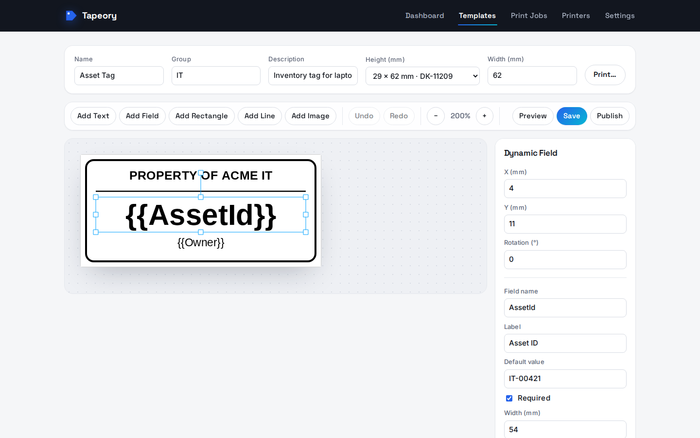
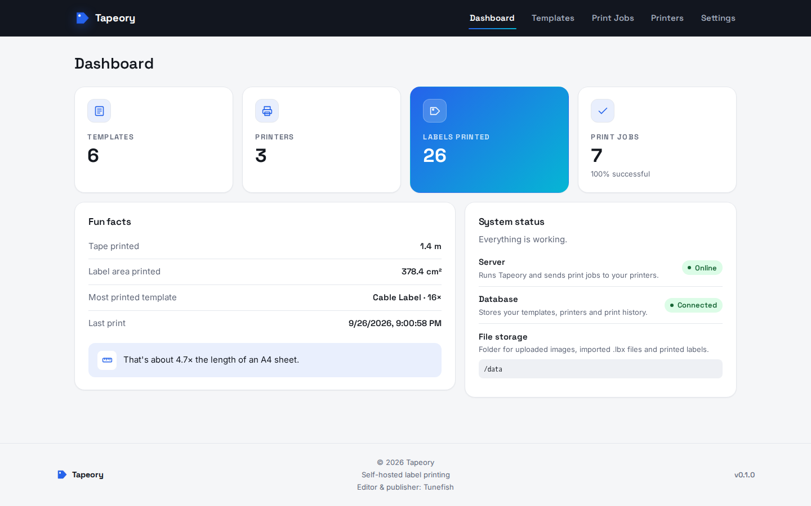
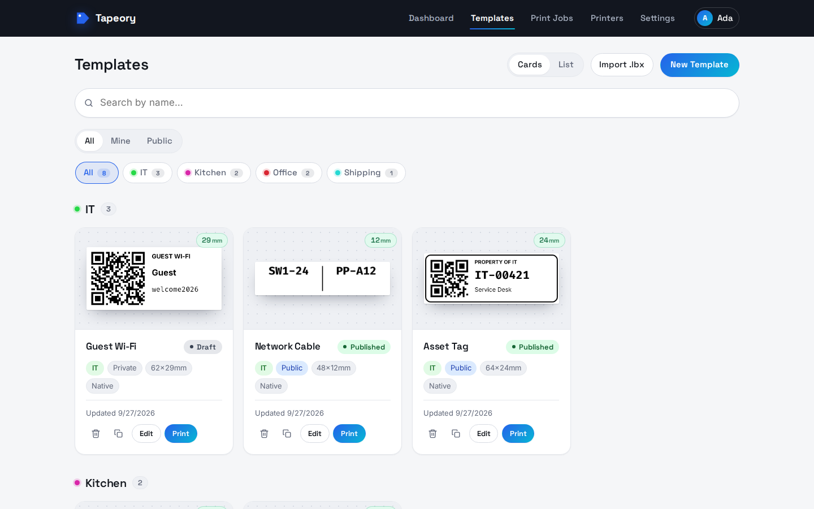
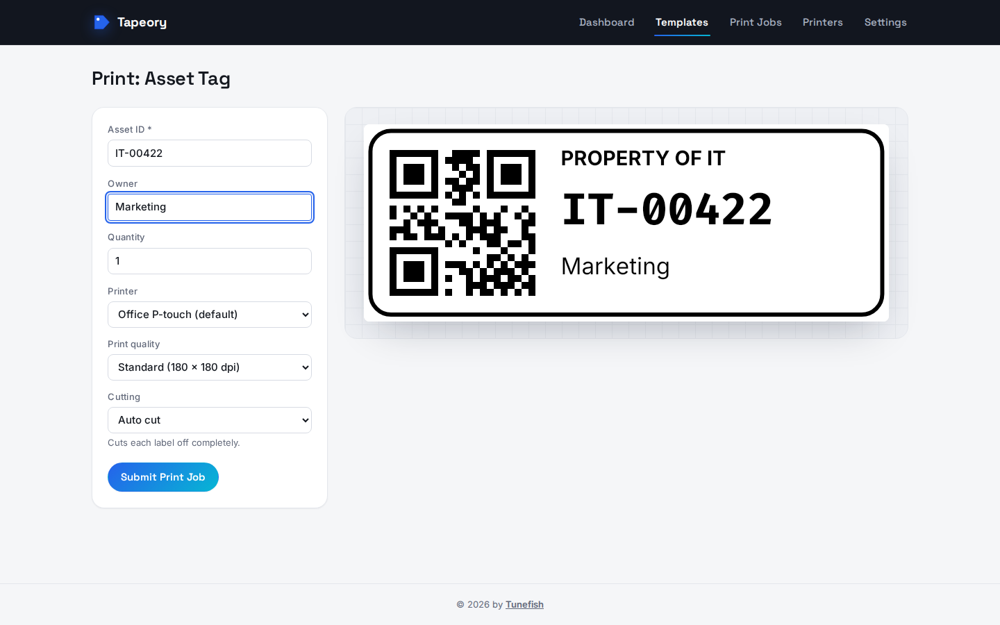
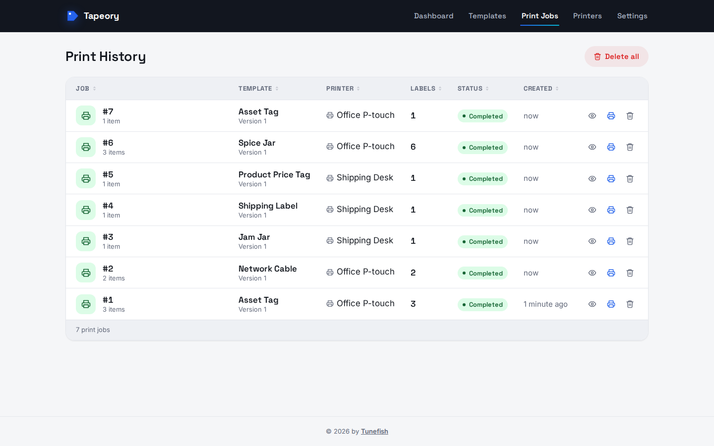
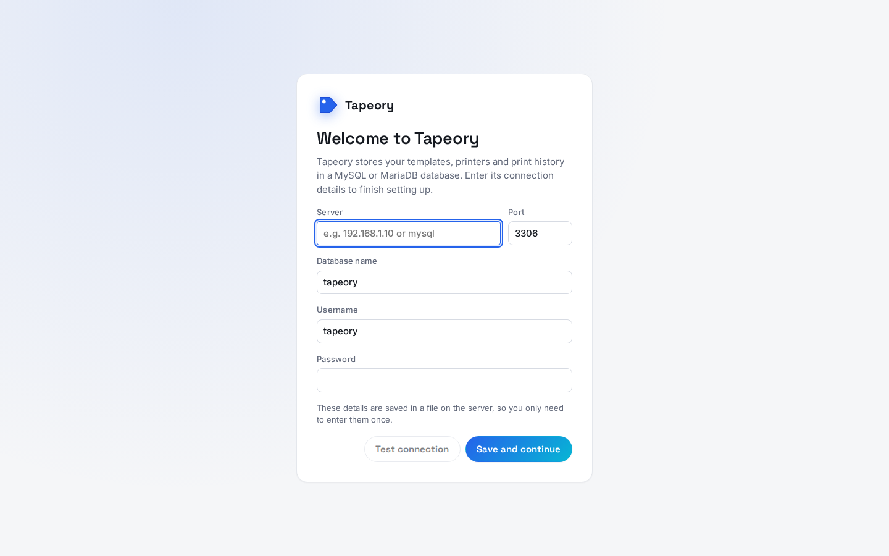
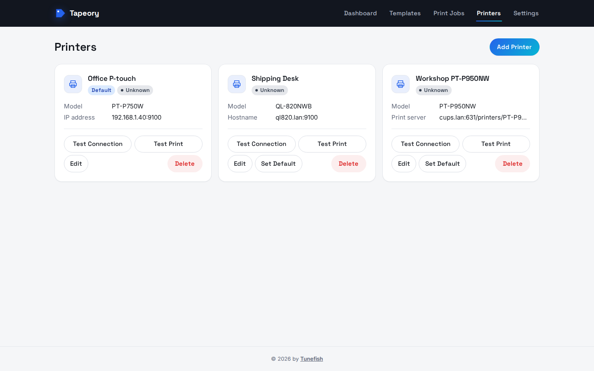
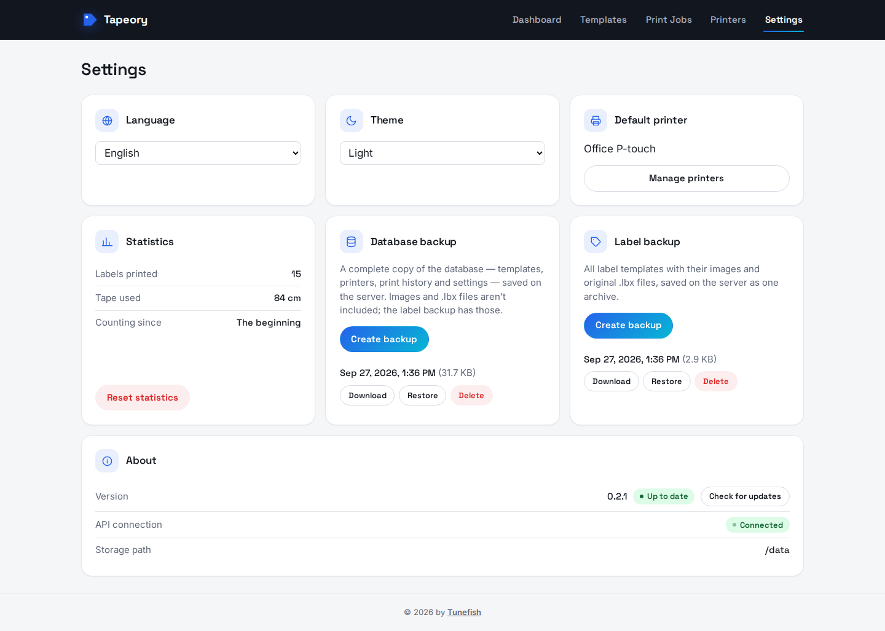

# Tapeory

[](https://github.com/Tunefish92/Tapeory/actions/workflows/ci.yml)

**Design, store, and print Brother P-touch labels from your browser.**

Tapeory is a self-hosted web app for label templates. Design a label in the browser editor, add
named fields like "Name" or "Room", and fill them in when you print. You can also import
existing P-touch Editor `.lbx` files. It runs as a single Docker container next to MySQL, or as
a [desktop app for Windows and Linux](#desktop-app-windows-and-linux), and every template,
upload, and print job stays with you.

> [!WARNING]
> **Early release (0.4).** Tapeory is still young: expect rough edges between minor versions.
> Designing, storing, importing, and rendering labels work and are covered by tests.
> **Printing** works with Brother P-touch (PT) and QL label printers in Brother's raster format:
> 34 models, from the PT-P750W and PT-P900 series to the QL-500 through QL-1115NWB. See
> [Supported printers](docs/printers.md) and [Known limitations](#known-limitations).



<table>
  <tr>
    <td width="50%"></td>
    <td width="50%"></td>
  </tr>
  <tr>
    <td align="center">Dashboard</td>
    <td align="center">Template library</td>
  </tr>
  <tr>
    <td width="50%"></td>
    <td width="50%"></td>
  </tr>
  <tr>
    <td align="center">Printing with a rendered preview</td>
    <td align="center">Print history</td>
  </tr>
</table>

## Features

**Label editor**
- Canvas editor with text, dynamic fields, barcodes and QR codes, rectangles, ellipses, lines, and
  images (PNG, JPEG, WebP, SVG; TIFF and BMP are converted to PNG)
- Move, resize, and rotate objects; change layer order; lock, hide, duplicate, and delete
- Undo/redo, zoom, arrow-key nudging, and keyboard shortcuts
- Text fitting for each text box: overflow, shrink to fit, or wrap at spaces and shrink
- Barcodes and QR codes: Code 128, Code 39, EAN-13, EAN-8, UPC-A, UPC-E, ITF, Codabar, QR,
  Data Matrix, PDF417, and Aztec, with a fixed value or one filled in from a field when printing.
  Bars are snapped to the printer's dots, so they stay scannable at 180 dpi.
- Brother media presets: TZe/HGe tape, HSe heat-shrink tube, DK continuous and die-cut rolls
- Preview mode that fills dynamic fields with sample values
- The editor uses the server's own fonts, so the preview matches the printed output. Thirteen
  Google Fonts ship with Tapeory (Roboto, Open Sans, Lato, Montserrat, Inter, IBM Plex Sans and
  Serif, Roboto Slab, Bebas Neue, League Spartan, Quicksand, Comic Neue, Fira Code), so they're
  there on every system

**Templates**
- Draft, published, and archived states, with an immutable version history
- Duplicate a template from the card or list view
- Groups (case- and accent-insensitive) with bulk rename, plus thumbnails
- Export and import in Tapeory's native JSON format
- **`.lbx` import:** converts text objects, database-merge fields, images, barcodes, and shapes from P-touch Editor
  files. Anything it can't convert is listed as a warning, and the original file stays
  available for download.

**Printing**
- Print form with values for each field, quantity, printer choice, print quality, cutting
  (auto cut, half cut, cut at end, chain printing, cut marks), and a preview that updates as you type
- Server-side rendering to PNG (300 DPI) and PDF with SkiaSharp
- Background print queue, with a job history and per-label previews
- Printing on Brother P-touch (PT, 180 and 360 dpi) and QL printers (300 dpi) in Brother's raster
  format: TZe tape up to 36 mm and HSe heat-shrink tube, and DK continuous rolls, die-cut and round
  labels up to 104 mm, including black/red DK-22251 on the QL-800 series. High resolution doubles
  the dots along the tape where the model supports it. The media follows the label size.
- Tape detection: Tapeory reads which tape the printer has loaded, warns in the print form when
  it doesn't match the template, and stops the job before printing onto the wrong tape
- Live print status from the printer (over SNMP): sending, printing, and finished once the
  printer's label counter confirms the labels came out, or the printer's own error, such as no
  tape or an open cover
- Printing through a CUPS/IPP print server queue, with the job followed until CUPS reports it done
- Printer management: IP address, hostname, print server, or USB entries, a default printer,
  and connection tests and test prints

**App**
- First-start setup screen for the database connection (no connection string needed)
- User accounts with two roles (administrator and user); everyone can change their own password
- Private templates by default, shared with everyone when made public; each account sees its own
  print history
- Database and label backups created and restored from the Settings page, stored on the server
- Dashboard with usage statistics
- Update check: Settings shows when a newer release is out on GitHub
- 5 UI languages: English, German, French, Italian, and Spanish
- Light, dark, or system theme; millimetres or inches
- Runs on `linux/amd64` and `linux/arm64`, with an Unraid Community Applications template

## Desktop app (Windows and Linux)

Tapeory also runs as a standalone app, without Docker or a server: download it from the
[latest release](https://github.com/Tunefish92/Tapeory/releases/latest) and start it.
Everything it needs is included (its engine brings its own .NET runtime); nothing else has to be
installed.

| System | Download | |
|---|---|---|
| Windows 10 or 11 (x64) | `Tapeory-<version>-windows-x64-setup.exe` | Installs for your user account, no administrator rights needed; updates itself |
| | `Tapeory-<version>-windows-x64.zip` | Portable: unpack anywhere and run `tapeory.exe` |
| Linux (x86_64) | `Tapeory-<version>-linux-x86_64.AppImage` | One file: make it executable (`chmod +x`) and run it; updates itself |
| | `Tapeory-<version>-linux-x86_64.tar.gz` | Unpack and run `./tapeory` |

On first start, Tapeory asks where to keep your data:

- **On this computer** (recommended): a local database in your user folder
  (`%LOCALAPPDATA%\Tapeory` on Windows, `~/.local/share/tapeory` on Linux). No accounts, nothing
  else to set up.
- **On a MySQL or MariaDB server**: shares templates, printers and the print history with a
  Tapeory server, for example your Docker installation. If that database has user accounts, you
  sign in as on the web.

The app has the same features as the web app (label editor, `.lbx` import, printing, print
history, printers, backups, statistics, accounts) plus printing to **USB printers** plugged into
the computer (on Linux for now, see below). It is available in the same five languages, in light and dark. The editor draws
with the same font files the printed label is rendered with, so what you see is what prints.
Tested on Windows and on Ubuntu 22.04 and 24.04, Debian 12, Fedora, openSUSE Tumbleweed and Arch.

Updates: **Settings → About** shows when a new release is out. The Windows setup and the
AppImage update themselves with **Update now**: the new version is downloaded, checked against
the release's SHA-256, installed, and started. The zip and tar.gz copies link to the release page
instead. Your data stays where it is when updating or uninstalling.

Good to know:

- Windows builds aren't code-signed yet (they will be, see
  [Code signing policy](#code-signing-policy)), so SmartScreen may warn on first start: choose
  **More info → Run anyway**.
- Linux needs glibc 2.35 or newer: Ubuntu 22.04, Debian 12, Linux Mint 21 or later, and current
  Fedora, openSUSE Tumbleweed and Arch.
- On Linux, the app needs a desktop with OpenGL and GTK 3, which every common desktop (GNOME,
  KDE, Xfce, Cinnamon, MATE) has. The AppImage also needs FUSE (`libfuse2` on older
  distributions); without it, run it with `--appimage-extract-and-run` or use the tar.gz.
- USB printing on Linux needs your user in the `lp` group
  (`sudo usermod -aG lp $USER`, then sign out and in again).
- USB printing on Windows is switched off for now: Windows Defender mistook the code that sends
  jobs to Windows printers for an exploit. It comes back once the Windows builds are code-signed.
  Printers on the network work on Windows as usual.
- With a shared database, each USB printer belongs to the computer it's plugged into: other
  computers see it but can't print to it, and their print jobs never end up on it.
- Logs are in the data folder under `logs/` (Settings → About shows the path).

## Quick start (Docker)

Requirements: Docker and Docker Compose.

```bash
git clone https://github.com/Tunefish92/Tapeory.git tapeory && cd tapeory
cp .env.example .env
# edit .env: set MYSQL_ROOT_PASSWORD and MYSQL_PASSWORD to real values
docker compose pull
docker compose up -d
```

This runs the prebuilt image `ghcr.io/tunefish92/tapeory` (for `amd64` and `arm64`) next to a
MySQL 8.4 container. The same image is on Docker Hub as
[`tunefish92/tapeory`](https://hub.docker.com/r/tunefish92/tapeory); set
`TAPEORY_IMAGE=tunefish92/tapeory:latest` in `.env` to pull from there instead. To build the image from your checkout instead, run
`docker compose up -d --build`.

The app (web UI and API together) runs at `http://localhost:8080`, or at whatever
`TAPEORY_PORT` you set in `.env`.

### Docker without Compose

If you already have a MySQL 8 or MariaDB server, the app container is all you need:

```bash
docker run -d --name tapeory \
  -p 8080:8080 \
  -v /path/to/tapeory-data:/data \
  -e PUID=1000 -e PGID=1000 \
  --restart unless-stopped \
  ghcr.io/tunefish92/tapeory:latest
```

Create an empty database and a user for it on your server. Then open `http://<host>:8080` and
enter the connection details there.

### Storage folder permissions

The container starts as root only long enough to give the storage folder to `PUID:PGID`
(default `1000:1000`), then runs the app as that user. Set both to the host user that should own
the files: run `id` on the host to see yours; on Unraid, use `99` and `100`. If you run the
container with `--user`, it skips this step, and the folder must already be writable by that
user.

### Image tags

| Tag | Contents |
| --- | --- |
| `latest` | The newest release |
| `0.4.0`, `0.3.0`, … | One specific release (from Git tags such as `v0.4.0`) |

Both registries get the same tags: `ghcr.io/tunefish92/tapeory` (GitHub Container Registry) and
`tunefish92/tapeory` (Docker Hub). For a stable install, pin a release tag with `TAPEORY_IMAGE`
in `.env`.

### Fonts

Tapeory ships thirteen Google Fonts with the app itself (Roboto, Open Sans, Lato, Montserrat,
Inter, IBM Plex Sans and Serif, Roboto Slab, Bebas Neue, League Spartan, Quicksand, Comic Neue,
Fira Code, each Regular and Bold), so they work the same in Docker and in a local run. The image
also includes the Liberation fonts (same letter widths as Arial, Times New Roman and Courier New)
and DejaVu. Beyond these, the editor and the renderer can use only fonts installed in the
container. To add more, build your own image on top of this one:

```dockerfile
FROM ghcr.io/tunefish92/tapeory:latest
RUN apt-get update && apt-get install -y --no-install-recommends fonts-noto-core \
 && rm -rf /var/lib/apt/lists/*
```

### First start: database connection

On first start, Tapeory asks for its database connection in the browser. With the bundled
`docker-compose.yml`, enter:



| Field | Value |
| --- | --- |
| Server | `mysql` |
| Port | `3306` |
| Database name | `MYSQL_DATABASE` from `.env` (default `tapeory`) |
| Username | `MYSQL_USER` from `.env` (default `tapeory`) |
| Password | `MYSQL_PASSWORD` from `.env` |

**Test connection** checks the details without saving them. **Save and continue** creates the
tables and saves the connection to `config/database.json` in the storage folder (`/data` in the
container), so you only enter it once. The file holds the password in plain text and only the
container user can read it. To change the connection later, edit or delete that file and restart
the container. After a connection is saved, the setup endpoints stop accepting new details.

If `ConnectionStrings__Default` is set (as an environment variable or in `appsettings*.json`),
it takes precedence over the file and Tapeory skips the setup screen.

Right after the database, Tapeory asks you to **create your account**. This first account is the
administrator; from then on, everyone has to sign in. See [Users](#users).

### Configuration

`docker-compose.yml` reads these environment variables from `.env`:

| Variable | Default | Purpose |
| --- | --- | --- |
| `MYSQL_ROOT_PASSWORD` | — (required) | MySQL root password |
| `MYSQL_DATABASE` | `tapeory` | Database name |
| `MYSQL_USER` | `tapeory` | Application database user |
| `MYSQL_PASSWORD` | — (required) | Application database user's password |
| `TAPEORY_PORT` | `8080` | Host port the app is served on |
| `TAPEORY_STORAGE_HOST_PATH` | `./tapeory-data` | Host folder mapped to the app's `/data`, which holds templates, uploads, and rendered print output |
| `PUID` / `PGID` | `1000` / `1000` | User and group that own the storage folder; the app runs as this user |
| `TAPEORY_AUTO_MIGRATE` | `true` | Apply database migrations on startup |
| `TAPEORY_IMAGE` | `ghcr.io/tunefish92/tapeory:latest` | Image to run; set it to pin a release |
| `ASPNETCORE_ENVIRONMENT` | `Production` | ASP.NET Core environment name |

The app container also understands `ConnectionStrings__Default`: a database connection string
that skips the first-start setup screen. `docker-compose.yml` doesn't forward it, so add it under
`api.environment` if you want it.

Everything else is set in the web UI and stored in MySQL or the browser: printers, templates,
language, theme, units, and the default printer.

## Printers

Add printers on the **Printers** page, then pick one when printing. Tapeory prints on Brother
P-touch (PT) and QL label printers; [docs/printers.md](docs/printers.md) lists every supported
model and how to connect it. Choose the model from the list so Tapeory knows its print head,
media, resolutions and cutting options; USB-only models print through a CUPS server.

- **Directly over the network** (connection type IP address or hostname): Tapeory sends the job
  to the printer's raw port, usually 9100, and follows it over SNMP until the printer's label
  counter confirms it printed. Give the printer a fixed IP address (a DHCP reservation).
- **Through a CUPS print server** (connection type print server): enter the server's address,
  port 631, and the queue name, as in `http://<server>:631/printers/<queue>`. Tapeory sends the
  job to that queue over IPP as raw data, so the queue's driver passes it through unchanged. In
  CUPS, set the queue's connection to **AppSocket/HP JetDirect** with
  `socket://<printer IP or hostname>:9100`; queues that CUPS found automatically
  (`dnssd://… .local`) often can't reach the printer, especially when CUPS runs in a container.
  Without a queue name, Tapeory sends to the server's raw port instead.
  When the queue prints to the printer's network address, Tapeory also asks the printer itself
  over SNMP, so tape detection, printer errors, and the label counter work through CUPS too.

**Test Connection** checks that the printer (or the CUPS queue) answers, and **Test Print** prints
a small label centred on the tape; its size can be set in the printer's settings.



## Users

The first account, created right after the database setup, is the **administrator**. Once it
exists, everyone has to sign in. Administrators add more accounts in **Settings → Users** and give
each one a role:

| Role | Can do |
| --- | --- |
| **Administrator** | Everything: printers, backups, statistics, and managing accounts |
| **User** | Design, import and print labels, and see their own print history |

**Templates are private by default:** only the account that created, imported or duplicated a
template sees it. Its owner can make it **public** (the Private/Public switch in the editor), and
then every account sees it and can print it or duplicate it into a private copy of their own; only
the owner and administrators can change it. Administrators see and change every template. The
templates page filters by **Mine · Public · All** and marks whose each template is. Templates from
before accounts existed stay shared with everyone, and only administrators can change them.
Images in a private template can't be loaded by other accounts either.

**Print history:** each account sees its own print jobs; administrators see everyone's. The
dashboard's label and tape totals cover the whole installation.

A new account gets a temporary password, shown once to the administrator who created it. On first
sign-in, the account has to choose its own password. Everyone can change their own password from
the account menu in the header; that signs them out on their other devices. Administrators can
change an account's role or name, disable it (its sessions end straight away), reset its password
to a new temporary one, or delete it; deleting asks whether its templates move to you (staying
private) or are deleted with it. Tapeory always keeps at least one active administrator. The
print history shows who printed each job.

**Upgrading from 0.3 or older:** existing installs stay open, as before, until someone creates
the first account. A banner at the top of every page offers to create it.

**Locked out?** If the only administrator's password is lost, set a temporary one on the server:

```bash
docker exec tapeory tapeory reset-password <user name>
```

Sign in with the printed password; Tapeory then asks for a new one. Sessions are cookies that last
30 days with "Stay signed in", or until the browser closes. After 5 wrong passwords for an account
(or 20 from one address), signing in pauses for 15 minutes.

## Upgrading

The desktop app updates itself (see [Desktop app](#desktop-app-windows-and-linux)). For the
server: **Settings → About** shows next to the version whether a newer release is out. To find out, the
server asks GitHub's API for the latest Tapeory release (at most every six hours, and only while
the settings page is opened); nothing about your installation is sent.

```bash
git pull                                      # updates docker-compose.yml and .env.example
docker compose pull && docker compose up -d   # or: docker compose up -d --build
```

Database migrations apply automatically on startup. To apply them yourself, set
`TAPEORY_AUTO_MIGRATE=false`. Before starting the container, run the migrations from a
development machine:
`dotnet ef database update --project Tapeory.Api --connection "<connection string>"`. With
auto-migrate off, the first-start setup only saves the connection and doesn't create tables.

See [CHANGELOG.md](CHANGELOG.md) for what changed between versions.

## Backup and restore

### From the app

**Settings** has two backup cards. Both save their backups on the server, in the storage folder's
`backups/` folder. Each backup can be downloaded, restored, or deleted there.



| Card | What it contains | Restoring it |
| --- | --- | --- |
| **Database backup** | A full SQL dump of the database: templates with all versions, printers, print history, settings | Replaces the whole database. Any newer migrations are applied afterwards, so backups from older Tapeory versions work too. |
| **Label backup** | A `.zip` of all templates (current version, fields, group, tags, status) plus their images, preview images and original `.lbx` files | Replaces all current templates with the ones in the backup. Print history is kept. |

Restoring a database backup also restores the accounts it contains (or none, for a backup from
before 0.4), so sign in with an account from the backup afterwards.

Before every restore, Tapeory backs up the current state and lists it as "Before restore", so you
can undo a restore by restoring that backup. The database dump doesn't contain the files in the
storage folder (images, `.lbx` originals); those are covered by the label backup, or by backing
up the storage folder as described below.

Backups stored in the storage folder are lost along with it, so download the important ones or
back up the storage folder somewhere else as well.

### Manually

Back up two things:

- the MySQL database
- the storage folder (`TAPEORY_STORAGE_HOST_PATH`). It holds the template, upload, and print
  files the database points to, plus `config/database.json` with the database password. Keep
  this backup somewhere private.

**Backup:**

```bash
# Database
docker compose exec mysql sh -c 'exec mysqldump -u root -p"$MYSQL_ROOT_PASSWORD" "$MYSQL_DATABASE"' > tapeory-db-backup.sql

# Storage folder (default location; adjust if you changed TAPEORY_STORAGE_HOST_PATH)
tar -czf tapeory-storage-backup.tar.gz -C ./tapeory-data .
```

**Restore** (onto a fresh install with the same `.env`):

```bash
docker compose up -d mysql
docker compose exec -T mysql sh -c 'exec mysql -u root -p"$MYSQL_ROOT_PASSWORD" "$MYSQL_DATABASE"' < tapeory-db-backup.sql

rm -rf ./tapeory-data && mkdir -p ./tapeory-data
tar -xzf tapeory-storage-backup.tar.gz -C ./tapeory-data

docker compose up -d --build
```

Always back up and restore the database and the storage folder together. If they come from
different points in time, the database can point at files that no longer exist, and some stored
files won't appear in the app.

## Unraid

Tapeory has a Community Applications template ([`unraid/tapeory.xml`](unraid/tapeory.xml)). It
needs a separate MySQL/MariaDB container, so install Unraid's official `mariadb` template first.
The template asks for a storage path and a web UI port, and sets `PUID=99` and `PGID=100`, so
files in the storage path belong to Unraid's usual `nobody:users`. You enter the database
connection in the web UI on first start (see [First start](#first-start-database-connection)).

To install it before it's listed in the Apps tab: on the **Docker** tab, click **Add Container**,
add `https://github.com/Tunefish92/Tapeory` under **Template repositories** at the bottom, save,
and pick **Tapeory** from the **Template** list.

On the Docker page, the container shows the Tapeory icon, and its menu has a **WebUI** entry that
opens the app. The image carries both as labels (`net.unraid.docker.icon` and
`net.unraid.docker.webui`), so they also work for a container started without the template,
for example with Compose.

## Support

Ask questions and share ideas in [GitHub Discussions](https://github.com/Tunefish92/Tapeory/discussions),
and report bugs as [issues](https://github.com/Tunefish92/Tapeory/issues). Please include your Tapeory
version (Settings page), your printer model, and the container log.

## Buy me a coffee

Tapeory is free and open source, and it will stay that way. If it saves you some fiddling with
labels and you'd like to say thanks, you can buy me a coffee:

**☕ [paypal.me/tunefish92](https://paypal.me/tunefish92)**

It's entirely voluntary and a thank-you only: it doesn't buy features, priority support or a
warranty, and the software stays under the MIT license either way. Please don't send money as
"Friends and Family" on PayPal.

## Code signing policy

Free code signing provided by [SignPath.io](https://about.signpath.io), certificate by
[SignPath Foundation](https://signpath.org).

The Windows programs and setup of each release are built from this repository by GitHub Actions
and signed there; Windows shows "SignPath Foundation" as their publisher. Only Tapeory's own
programs are signed (`tapeory.exe`, `Tapeory.Api.exe`, `Tapeory.Api.dll` and the setup), not
the third-party libraries shipped with them.

- Committers and reviewers: [Tunefish92](https://github.com/Tunefish92)
- Approvers: [Tunefish92](https://github.com/Tunefish92)

### Privacy

Tapeory doesn't collect data and sends nothing to its authors. It contacts only:

- **GitHub**, to check for a new release (`api.github.com`, when you open the Settings page or
  Settings → About in the desktop app) and, when you choose **Update now**, to download it;
- the printers, print servers and database server you set up yourself.

## License

Tapeory is released under the [MIT License](LICENSE).

## Known limitations

- **Only Brother PT and QL printers with a published raster protocol can print** (34 models, see
  [Supported printers](docs/printers.md)). Brother's TD, RJ and PJ series, and P-touch models
  without a published protocol (such as the PT-D610BT or PT-D800W), aren't supported.
- **Tested on real hardware: the PT-P750W.** QL and 360 dpi P-touch printing follows Brother's
  Raster Command References exactly, but hasn't been tried on those printers yet. Reports are
  welcome in [GitHub Discussions](https://github.com/Tunefish92/Tapeory/discussions).
- **USB-only models print from the computer they're plugged into**: with the desktop app on Linux, or
  through a CUPS server with a raw queue; a Docker container needs the device passed in
  (`--device /dev/usb/lp0`).
- **Print status needs SNMP.** Tapeory reads it with the `public` community, which Brother
  printers enable by default. Without SNMP, jobs are marked done once they're sent.
- **Tape detection needs SNMP too.** Behind a CUPS server it works when the queue prints to the
  printer's network address (socket://, ipp://, lpd://), not for USB or dnssd:// queues; without
  it, the tape width simply follows the label height.
- **USB printers** print from the computer they're plugged into, through `/dev/usb/lp*` on
  Linux (the user needs to be in the `lp` group); on Windows, USB printing is switched off for
  now. There's no tape detection or print confirmation over USB: a job counts
  as done once the printer took it.
- **`.lbx` import** converts text, merge fields, images, barcodes, rectangles, ellipses, lines,
  and frames (as simple borders). Free-form shapes and a few rare barcode types are reported as
  warnings instead of being converted.
- **Sign-in is built in, but runs over plain HTTP** unless you put Tapeory behind a reverse proxy
  with HTTPS; on an untrusted network, use one. Until the first account is created, anyone who
  can reach the port can use the app.
- **Two roles only** (administrator and user). Templates are private or public, with no sharing
  with just some accounts; printers are shared by all.

## Local development

Requirements: .NET 10 SDK, Node.js 22+, and either Docker (for a local MySQL container) or a
MySQL 8 server.

Run each step in its own terminal:

```bash
docker compose -f docker-compose.dev.yml up -d --wait mysql
dotnet run --project Tapeory.Api                # API on http://localhost:5215
cd Tapeory.Web && npm install && npm run dev     # web app on http://localhost:5173
```

On Arch-based distributions, the .NET SDK packages don't include ASP.NET Core; install
`dotnet-sdk`, `aspnet-runtime` and `aspnet-targeting-pack`.

Run both at the same time: the frontend dev server proxies `/api/*` to `http://localhost:5215`
(see `Tapeory.Web/vite.config.ts`). Open `http://localhost:5173`. On first run, enter the local
MySQL container's details in the setup screen: server `localhost`, port `3306`, and `tapeory`
as the database, username, and password. They're saved to
`Tapeory.Api/local-storage/config/database.json` (gitignored).

### Desktop app

The desktop app (`Tapeory.Desktop/`) is written in Rust with [egui](https://github.com/emilk/egui)
and starts `Tapeory.Api` as its engine: a local server on 127.0.0.1 that only answers the app
(a secret per start) and stops when the app closes. Requirements: Rust (stable) and, on Linux,
the GTK 3 development files (`libgtk-3-dev` on Debian/Ubuntu).

```bash
dotnet build Tapeory.Api                          # the engine, found in its build output
cd Tapeory.Desktop && cargo run                   # the app
```

`TAPEORY_DATA_FOLDER` uses another data folder, `TAPEORY_ENGINE` another engine. The packages
are built by `Tapeory.Desktop/packaging/linux/build.sh <version>` (tar.gz and AppImage) and, on
Windows, by the CI steps with `Tapeory.Desktop/packaging/windows/tapeory.iss` (Inno Setup).
`TAPEORY_UPDATE_FEED` points the update check at another "latest release" address, to try an
update before publishing it. `TAPEORY_RENDERER` picks the renderers to try, in order (`wgpu`,
`glow`, or e.g. `glow,wgpu`); by default Windows tries Direct3D through wgpu first and Linux
OpenGL through glow.

The Windows packages can also be built on Linux, with Docker:

```bash
cd Tapeory.Desktop
docker run --rm -v "$PWD/..":/src -w /src/Tapeory.Desktop messense/cargo-xwin \
  cargo xwin build --release --target x86_64-pc-windows-msvc      # tapeory.exe
dotnet publish ../Tapeory.Api -c Release -r win-x64 --self-contained -p:DebugType=none -o <dir>/Tapeory/engine
# with tapeory.exe copied to <dir>/Tapeory: the setup
docker run --rm -v <dir>:/work -v "$PWD/packaging/windows":/iss amake/innosetup \
  /DAppVersion=<version> '/DSourceDir=Z:\work\Tapeory' '/DOutputDir=Z:\work' Z:\\iss\\tapeory.iss
```

### Running tests

```bash
dotnet test Tapeory.slnx          # backend; integration tests need Docker running (Testcontainers)
TAPEORY_TEST_DATABASE=sqlite dotnet test Tapeory.slnx   # the same on SQLite (the desktop database)
cd Tapeory.Web && npm test        # frontend
cd Tapeory.Desktop && cargo test  # desktop app
```

`Tapeory.Desktop/tests/engine_realtest.py` runs a packaged engine the way the app does and goes
through every feature against a fake printer on port 9100; the data folder it leaves behind is a
sample database (accounts `demo` / `Tapeory-Demo-2026` and `alex` / `Alex-Password-2026`).

On every push and pull request to `main`, GitHub Actions:

1. runs both test suites and type-checks and builds the frontend
2. builds the Docker image, starts it, and checks that it answers, fixes the storage folder
   owner, runs as the app user, and ships its fonts
3. builds the desktop app for Windows (setup and zip) and Linux (AppImage and tar.gz), and checks
   that the packaged engine starts in desktop mode

Pushes to `main` and version tags (`v*`) then publish a multi-arch image (`amd64`, `arm64`) to
GitHub Container Registry. If the repository variable `DOCKERHUB_USERNAME` and the secret
`DOCKERHUB_TOKEN` are set, the same image also goes to Docker Hub, and the Docker Hub page's
overview is updated from [`docs/dockerhub.md`](docs/dockerhub.md). The token needs the
"Read, Write, Delete" scope, because editing a repository's description requires it. To republish `main` without a
new commit, use **Run workflow** on the CI workflow in the Actions tab.

To release a version, update `CHANGELOG.md`, then push a tag: `git tag v0.4.0 && git push --tags`.
The tag's CI run attaches the desktop packages to the GitHub release (and creates the release if
it doesn't exist yet).

### Tech stack

- **Backend:** ASP.NET Core (.NET 10), EF Core with Pomelo MySQL, SkiaSharp and Svg.Skia for rendering
- **Frontend:** React 19, TypeScript, Vite, Konva / react-konva, react-i18next
- **Desktop app:** Rust, eframe / egui, with the backend as its engine (SQLite or MySQL)
- **Tests:** xUnit and Testcontainers (backend); Vitest and React Testing Library (frontend);
  `cargo test` (desktop app)

### Project layout

- `Tapeory.Api/`: ASP.NET Core backend (REST API, rendering, background print queue, EF Core migrations)
- `Tapeory.Web/`: React + TypeScript frontend (Vite)
- `Tapeory.Api.Tests/`: backend unit and integration tests
- `Tapeory.Desktop/`: the desktop app (Rust, egui) and its packaging
- `unraid/`: Unraid Community Applications template and icon
- `ca_profile.xml`: repository profile for Unraid Community Applications
- `docs/screenshots/`: the screenshots in this README
- `docs/feature-requests/`: planned features, e.g. bulk printing from a spreadsheet
- `.github/workflows/`: CI pipeline
